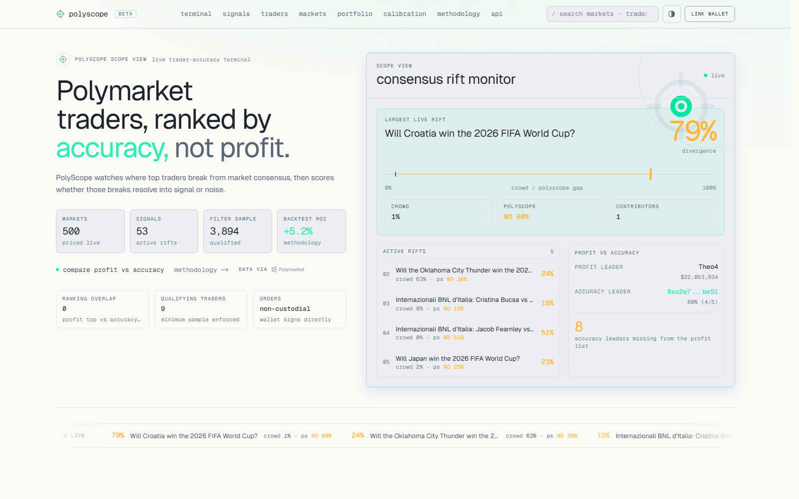
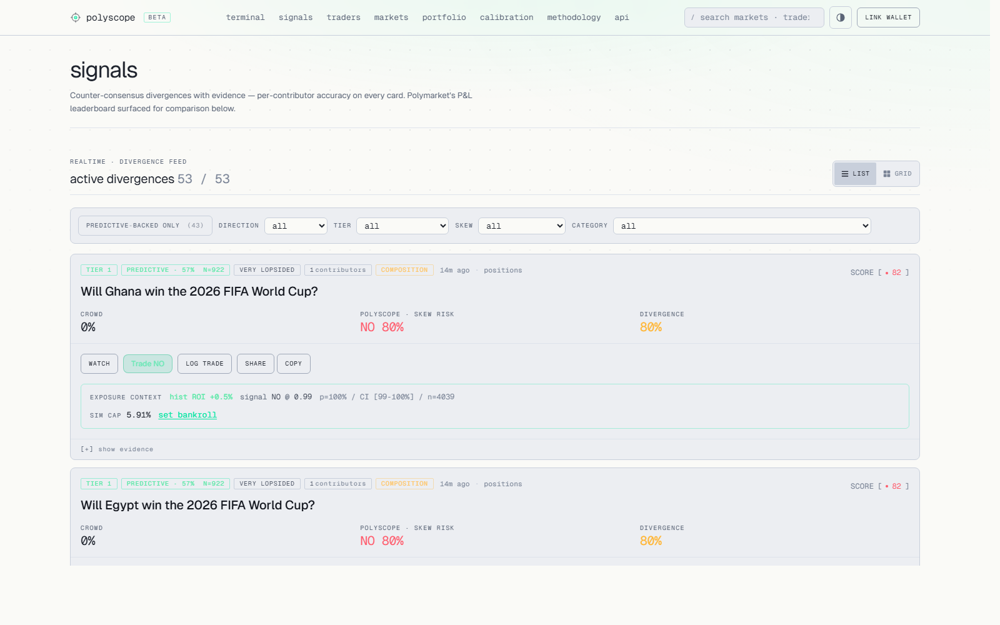
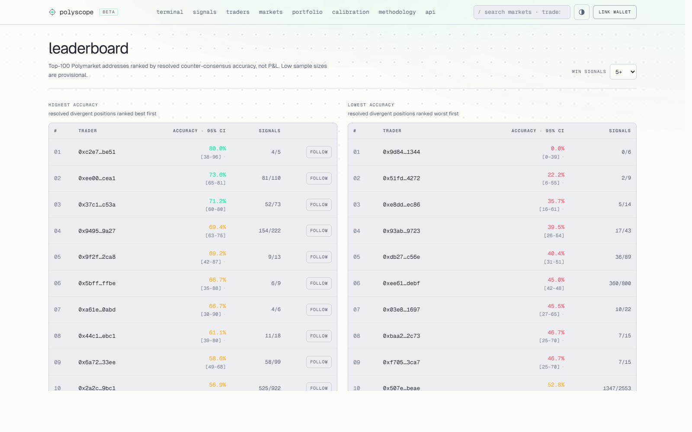
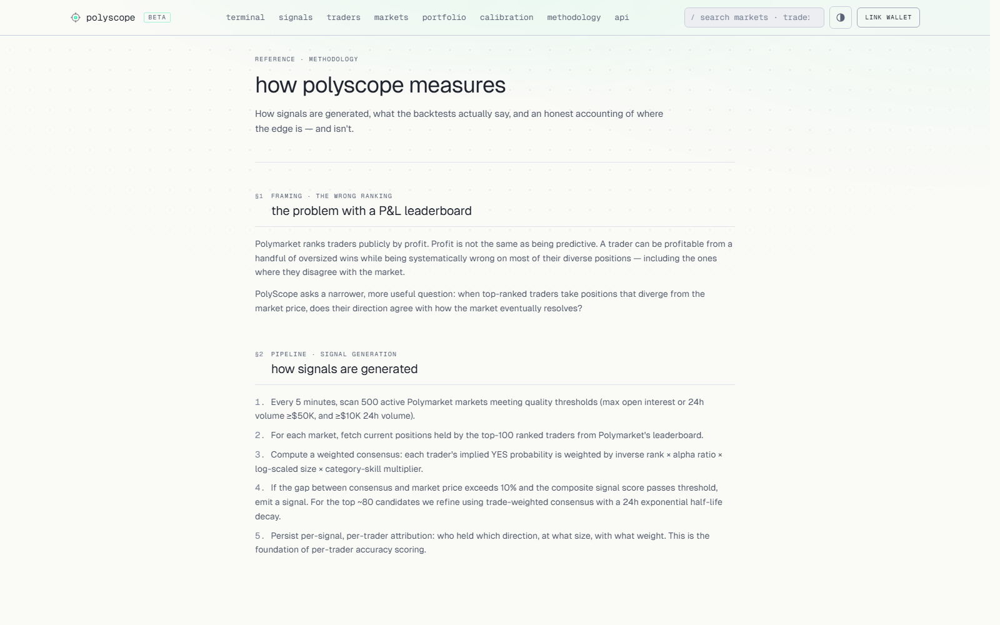
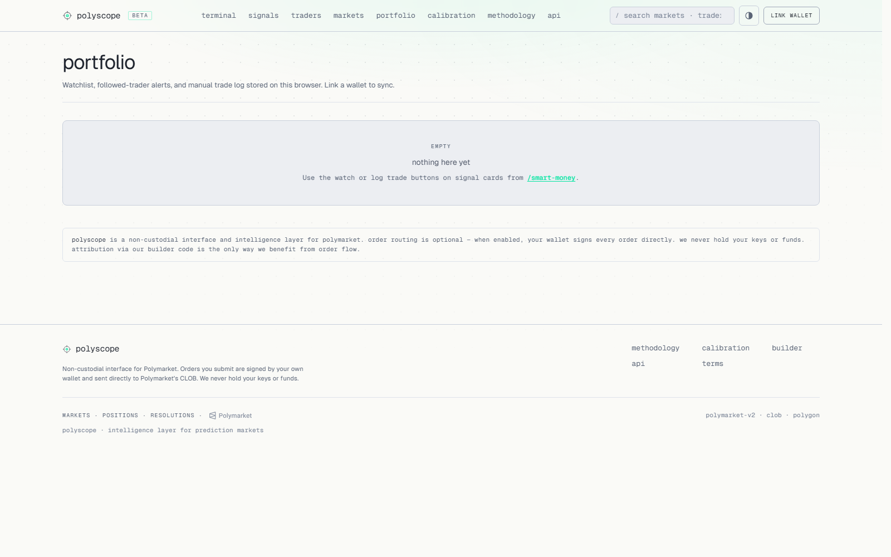
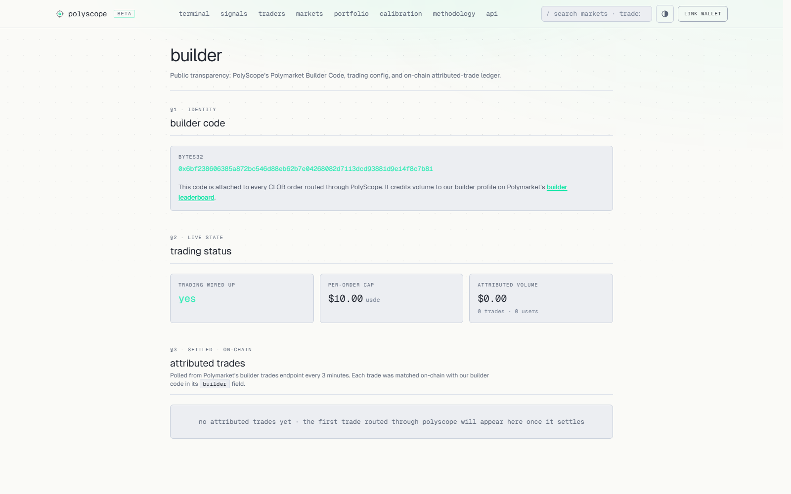

# PolyScope

> **Counter-consensus intelligence for Polymarket.** Tracks where crowd consensus disagrees with top-ranked traders — and scores which of those traders are *actually* predictive.

[](https://polyscope.gudman.xyz)
[](#tests)
[](#architecture)
[](https://polyscope.gudman.xyz/builder)

[**Live demo →**](https://polyscope.gudman.xyz) &nbsp;·&nbsp; [Methodology →](https://polyscope.gudman.xyz/methodology) &nbsp;·&nbsp; [API docs →](https://polyscope.gudman.xyz/api/docs)



---

## Why this exists

Polymarket's built-in leaderboard ranks traders by **profit**, not by **prediction accuracy**. Those aren't the same thing — a trader can be wildly profitable on a few oversized wins while being systematically anti-predictive on the rest of their positions.

PolyScope rebuilds the leaderboard around the question that actually matters for prediction: **on resolved markets where this trader took a counter-consensus position, how often were they right?** Per-trader, per-signal, per-skew-band, with Wilson 95% confidence intervals.

The result is a small set of genuinely predictive addresses that PolyScope flags as "predictive contributors" — and a much larger set of leaderboard names whose counter-consensus calls are noise. Every signal carries its evidence trail; every claim on the methodology page renders from live data.

---

## What you can do

### Counter-consensus signal feed



The `/smart-money` page shows live divergences between Polymarket crowd consensus and top-trader positions, ranked by composite score. Each DecisionCard exposes the structured thesis, contributor count, confidence tier, market-skew band, and explicit invalidators. Filter by predictive-backed signals only, by direction, by tier, or by category.

### Per-trader accuracy leaderboards



`/traders` shows two ranked leaderboards — **predictive** (highest accuracy on resolved divergent signals) and **anti-predictive** (lowest). Sample sizes, Wilson 95% confidence intervals, and skew/category breakdowns are exposed for every address. Click any wallet for its full per-signal history.

### Public methodology page



`/methodology` documents the model honestly: how signals are scored, why the contrarian-everywhere strategy is wrong, why the predictive-backed filter delivers a real but small edge over baseline, and the composition effects behind every headline number. The page renders from live data — claims update automatically as more markets resolve.

### Portfolio + watchlist + Telegram alerts



Anonymous `client_id`-keyed watchlist (no account, no wallet required), manual trade log with PnL estimate, and outcome-resolved tracking. Connect a wallet to sync across devices. Connect Telegram via `/connect <id>` in [@polyscoppe_bot](https://t.me/polyscoppe_bot) for whale-flow alerts and follow-trader DMs.

### Builder Code attribution



`/builder` exposes the public Builder Code (`0x6bf2…c7b81`) and the live attributed-trade table. Trades placed via PolyScope's DecisionCard "Trade" button settle from the user's relayer-deployed Polymarket DepositWallet — the address is derived from the connected EOA and deployed gaslessly through Polymarket's Builder Relayer on first use. Orders sign POLY_1271 with the Builder Code attached, and surface in this table within ~3 minutes via the `sync_attributed_trades_job` polling loop. The Builder API Secret + Passphrase live only on the server: the browser fetches per-request HMAC headers from `POST /api/polymarket/builder/sign`. **Non-custodial** — PolyScope never holds keys.

---

## The signal engine

### Divergence detection — `src/polyscope/divergence.py`

For every market with sufficient liquidity (≥$50K open interest, ≥$10K 24h volume), PolyScope fetches positions from the top-100 leaderboard traders and computes a weighted consensus:

```
weight(trader, position) = (1 / rank)
                         × (1 + alpha_ratio × 100)
                         × (1 + log10(max(size, 1)))
                         × category_skill_multiplier
```

A signal fires when `|market_price − sm_consensus| ≥ 10%` AND the composite score crosses the per-band threshold. Source can be positions or recent trades (trade-weighted uses a 24h exponential half-life decay).

### Why "fade the smart money" doesn't work

Backtest on resolved signals showed the original fade-everywhere strategy was negative-EV on every band where real alpha lives — the 96% headline win rate was a composition effect concentrated entirely in very-lopsided markets where simply predicting the favored side wins ~99.6% of the time.

Live strategy: **fade SM only on very-lopsided markets; follow SM on tight, moderate, lopsided.** Net win rate 97.2%, ROI **+5.3%** vs **+4.6%** baseline (post-bug-fix May 6 numbers).

### Per-trader accuracy — `signal_trader_positions` table

Every signal persists the individual traders who contributed to it (address, rank, direction, size, weight). Once a market resolves, each contributor is scored against the outcome. The aggregate is `trader_accuracy` — actual predictive hit rate per address, stratified by skew band and category.

The predictive-contributor filter qualifies a signal if any contributing trader has (a) `n ≥ 30` resolved signals, (b) accuracy `> 50%`, and (c) Wilson lower-bound `≥ 40%`. Currently 6 traders qualify; the pool grows as per-trader capture accumulates.

---

## Architecture

```
┌─────────────────────────────────────────────────────────────┐
│  Polymarket APIs                                            │
│  ├─ Gamma         (markets, resolution)                     │
│  ├─ Data API      (positions, trades, leaderboard)          │
│  ├─ CLOB v2       (POLY_1271 orders from DepositWallet)     │
│  └─ Relayer v2    (gasless DepositWallet deploy + ops)      │
└─────────────────────────┬───────────────────────────────────┘
                          │
         ┌────────────────▼─────────────────┐
         │  FastAPI + APScheduler           │
         │  (api/ — Python 3.12)            │
         │                                  │
         │  Jobs (every 5–60 min):          │
         │  • fetch_markets                 │
         │  • fetch_leaderboard             │
         │  • compute_divergences           │
         │  • detect_whale_trades           │
         │  • track_outcomes                │
         │  • rebuild_trader_accuracy       │
         │  • sync_builder_orders           │
         │  • sync_attributed_trades        │
         └────────────────┬─────────────────┘
                          │
                          ▼
                 ┌────────────────┐
                 │  SQLite (WAL)  │
                 │  /app/data/    │
                 └────────┬───────┘
                          │
            ┌─────────────┼─────────────┐
            │             │             │
            ▼             ▼             ▼
   ┌───────────────┐ ┌─────────┐ ┌──────────────┐
   │  Next.js 15   │ │ Telegram│ │  REST API    │
   │  (web/)       │ │  Bot    │ │  /api/*      │
   │  + wagmi 3    │ │ Alerts  │ │              │
   └───────────────┘ └─────────┘ └──────────────┘
                          │
                          ▼
                  nginx + TLS + GeoIP2 + per-IP rate limits
```

| Component | Stack | Container | Role |
|-----------|-------|-----------|------|
| `api`     | FastAPI + SQLite + APScheduler | `polyscope-api`  | Signal engine, data capture, REST |
| `web`     | Next.js 15 + Tailwind + Recharts + wagmi 3 | `polyscope-web`  | Dashboard + browser-side RelayClient/ClobClient. DepositWallet auto-derived from connected EOA; gasless deploy via relayer; orders sign POLY_1271 |
| `bot`     | python-telegram-bot                     | `polyscope-bot`  | Whale alerts + follow-trader DMs |

All services run as Docker containers behind nginx. TLS via Let's Encrypt webroot. US-region trade-facilitation endpoints geoblocked via `libnginx-mod-http-geoip2` + DB-IP Lite (auto-refreshed monthly).

---

## API

| Endpoint | Returns |
|----------|---------|
| `GET /api/divergences` | Current active divergence signals |
| `GET /api/divergences/history` | Resolved signals with outcome scoring |
| `GET /api/signals/evidence/{market_id}` | Full evidence trail for a signal |
| `GET /api/signals/accuracy` | Aggregate hit rate, by tier, 30d rolling |
| `GET /api/traders/leaderboard?order=predictive\|anti-predictive` | Per-trader accuracy ranking |
| `GET /api/traders/{address}` | Individual trader profile + skew/category breakdown |
| `GET /api/calibration` | Brier scores and calibration by category |
| `GET /api/methodology/stats` | Live numbers backing the methodology page |
| `GET /api/whale-flow` | Recent large entries from tracked top-trader addresses |
| `GET /api/builder/identity` | Public Builder Code |
| `GET /api/builder/trades/public` | Attributed trades + aggregate stats |

Full OpenAPI at [`/api/docs`](https://polyscope.gudman.xyz/api/docs).

---

## Quickstart

Requires: Python 3.12+, Node 20+, Docker.

### Backend

```bash
git clone https://github.com/Ridwannurudeen/polyscope.git
cd polyscope
pip install -e .
cp .env.example .env  # fill in TELEGRAM_BOT_TOKEN, POLYMARKET_BUILDER_CODE
python -m uvicorn api.main:app --reload --port 8020
```

### Frontend

```bash
cd web
npm install
npm run dev   # http://localhost:3000
```

### Tests

```bash
python -m pytest -q   # 224 backend tests
cd web && npm run lint && npx tsc --noEmit
```

### Docker (matches production)

```bash
docker compose up -d
```

Exposes `api:8021`, `web:3020`. Edit `docker-compose.yml` for local ports.

---

## Configuration

Copy `.env.example` to `.env`. **Required** for production:

| Variable | Purpose |
|----------|---------|
| `TELEGRAM_BOT_TOKEN` | Telegram alert bot |
| `POLYMARKET_BUILDER_CODE` | Public Builder Code baked into browser-signed CLOB orders |
| `POLYSCOPE_ADMIN_TOKEN` | Admin metrics token, sent via `X-Admin-Token` header |

**Recommended:**

| Variable | Purpose |
|----------|---------|
| `POLYMARKET_BUILDER_API_KEY` / `_SECRET` / `_PASSPHRASE` | Authenticated builder API. Powers `sync_attributed_trades_job` and the server-side HMAC sign proxy that issues `POLY_BUILDER_*` headers to the browser per request |
| `POLYMARKET_RELAYER_URL` | Builder Relayer endpoint for gasless DepositWallet deploys + ops (default `https://relayer-v2.polymarket.com/`) |
| `POLYMARKET_CLOB_HOST` | Defaults to `https://clob.polymarket.com` |
| `POLYSCOPE_ALLOW_DEV_DOMAINS=1` | Enable `localhost`/`testserver` in wallet-link allowlist (off by default) |

**Browser trading is non-custodial.** Users sign wallet-link messages and CLOB orders in their own wallet. The legacy `/api/sign` route was deliberately removed.

The optional server-side admin trading variables (`POLYMARKET_PRIVATE_KEY`, `POLYMARKET_FUNDER_ADDRESS`, `POLYMARKET_SIGNATURE_TYPE`, `POLYMARKET_MAX_ORDER_USDC`) exist for diagnostic order placement only — production attribution flows through the browser.

---

## Production

After deploy, run the smoke check:

```bash
python scripts/production_smoke.py --base-url https://polyscope.gudman.xyz

# With admin metrics:
POLYSCOPE_ADMIN_TOKEN="$POLYSCOPE_ADMIN_TOKEN" \
  python scripts/production_smoke.py --base-url https://polyscope.gudman.xyz
```

Verifies the web pages, Builder Code identity, public builder trades, admin auth, server-side trade metadata for a live market, and Polymarket's geoblock endpoint. Wallet-link signing and order placement remain manual checks.

Full deploy + security checklist: [`docs/production-runbook.md`](docs/production-runbook.md).

### Hardening highlights (May 6 2026 audit)

- HSTS + CSP locked to gamma + clob + polymarket + polygon-rpc origins
- Per-IP `limit_req_zone` on `/api/wallet/link` (10/min), `/api/events` (60/min), `/api/orders/*` + `/api/admin/*` (30/min), default `/api/` (120/min)
- US geoblock on `/builder` + `/api/market/*/trade` + `/api/orders/place` via geoip2 against `$remote_addr` (cannot be spoofed via X-Forwarded-For)
- Wallet-link signature: EIP-191, 300s TTL, domain allowlist, `hmac.compare_digest` admin token compare
- nginx upstream keepalive + `proxy_http_version 1.1` + bounded `proxy_*_timeout` (eliminates 502s under scan-window load)
- Per-route Cache-Control: `s-maxage=120, stale-while-revalidate=600` on read endpoints; `max-age=31536000, immutable` on `/_next/static/`
- gzip on JSON + JS + CSS + SVG (78% body reduction on `/api/divergences`)

---

## Status

| | |
|---|---|
| Signals tracked | **340K+** |
| Resolved signals | **187K+** across **4,188** markets |
| Markets watched | up to **500** active per scan cycle |
| Live qualifying predictive traders | 6 (Wilson-95% gated) |
| Backend tests | **224 passing** |
| Capture window | **28+ days** since per-trader system live (Apr 12 2026) |

### What's built

- ✓ Per-signal contributor attribution + evidence trail
- ✓ Methodology page (live, dynamic, self-correcting)
- ✓ DecisionCards with thesis, invalidators, confidence tiers, sizing hints
- ✓ Portfolio + watchlist + manual trade log + PnL estimate
- ✓ Predictive-contributor filter (Wilson-gated)
- ✓ Browser-signed Builder Code attribution (Phase C)
- ✓ Telegram bot — alerts, digests, follow-trader DMs, identity link
- ✓ US geoblock on trade-facilitation surfaces
- ✓ Per-IP rate limits + nginx hardening + TLS + HSTS + CSP
- ✓ `signal_trader_positions` capture: ~18.7K rows/day

---

## License

Code is not currently open-source licensed. Contact for commercial use.
